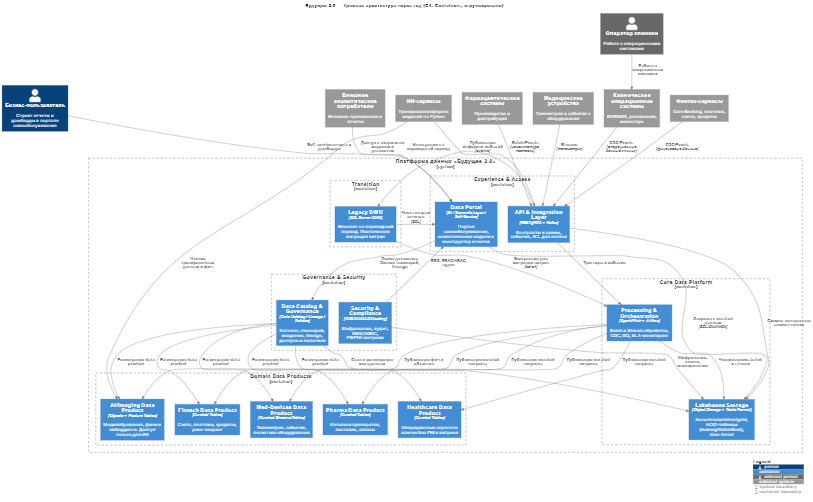

# Task1: Целевая архитектура через год

---

**Идея**

1. Данные живут в Data Lakehouse (структурированные и полу/неструктурированные для ИИ)  
2. Домены работают по Data Mesh: каждое подразделение публикует свои Data Products с контрактами качества  
3. Над всем стоит Data Catalog с управлением метаданными, доступами и сквозной трассировкой  
4. «Витрина данных» = самообслуживание: BI, семантический слой и конструктор отчетов  
5. Медкарты и исследования не попадают в витрину, но доступны ИИ в соответствующем домене с жестким управлением доступом  

---

## Контейнеры (C4: уровень контейнеров)

1. **Портал самообслуживания (Data Portal)**  
- BI-инструмент и конструктор отчетов  
- Семантический слой (dbt metrics, semantic layer, BI semantic model)  
- Доступ через роле-базовую модель и атрибуты (ABAC)  

2. **Data Catalog и Governance**  
- Каталог данных и метаданных (бизнес-глоссарий, lineage, SLA)  
- Управление доступом, маскирование, PII-политики, согласования  
- Поиск и описание data products  

3. **Lakehouse Storage**  
- Объектное хранилище (raw/bronze, refined/silver, curated/gold зоны)  
- Табличный формат (Iceberg/Delta/Hudi) для ACID-таблиц и тайм-тревела  
- Разделение по доменам  

4. **Data Processing и Orchestration**  
- Потоки и стриминг (Kafka, PubSub, EventHub) плюс CDC из операционных БД  
- Batch и stream обработка (Spark, Flink), оркестрация (Airflow)  
- Качество данных (Great Expectations, Deequ), валидации, SLA-мониторинг  

5. **Domain Data Products (Data Mesh)**  
- Клиники (Healthcare Domain): расписания, операции, ресурсы, агрегаты без PHI в витрине  
- Медизображения и ИИ (AI и Imaging Domain): изображения, фичи и эмбеддинги, изоляция PHI, доступ только ИИ-сервисам  
- Финтех (Fintech Domain): счета, платежи, кредитные продукты, риск-скоринг  
- Фарма (Pharma Domain): каталоги препаратов, поставки, запасы  
Мед-оборудование (Med-Devices Domain): телеметрия, события, логистика  
- Каждый домен публикует курируемые наборы (gold) с четкими контрактами (схема, SLA, качество)  

6. **API и Integration Layer** 
- Контракты для междоменного обмена (API, стримы), версионирование схем  
- Анти-коррапшн слой для легаси  

7. **Legacy DWH (домен Legacy и Clinical Core)**  
- Сохраняется на переходный период: часть отчетов и источников  
- Постепенная миграция витрин и трансформаций в Lakehouse  

8. **Security и Compliance**  
- Управление ключами, шифрование, аудит, Data Loss Prevention  
- Разделение PHI и PII, де-идентификация, токенизация  

---

## Проблемные места «как есть»

| № | Проблема | Как проявляется | Риск для бизнеса |
|---|----------|-----------------|-----------------|
| 1 | DWH — узкое горлышко | Все данные и логика завязаны на один монолит | Отчеты строятся часами, дорого масштабировать |
| 2 | Сложная интеграция новых бизнесов | Новые домены требуют «прописывать» логику в DWH | Долгий time-to-market, тормозит сделки и интеграции |
| 3 | Смешение медицинских и финансовых данных | Нет четкого разделения доменов и политик доступа | Регуляторные риски, риск утечек |
| 4 | Слабая видимость данных | Нет сквозного каталога и lineage | Дубли, ошибки, низкое доверие к данным |
| 5 | ESB (старая шина) перегружена | Сложные маршруты, tight coupling | Хрупкость, высокая стоимость изменений |
| 6 | Отсутствие self-service | BI поверх DWH, без витрины и конструктора | Нагрузка на ИТ, медленные циклы |
| 7 | Нет единых стандартов качества | Разные правила на уровне отчетов и ручных трансформаций | Ошибочные решения, репутационные потери |
| 8 | Неподготовленность к ИИ-нагрузкам | Медкарты и изображения хранятся под аналитический сценарий | Дорогие ETL, нет гибкости для ML и feature store |

---

## Приоритизация проблем (MoSCoW)

**Must**  
- Ввести Data Catalog и Governance (№4)  
- Развернуть Lakehouse с табличным форматом (№1 и №8)  
- Запустить Data Mesh ядро: выделить домены и приоритетные data products (№2, №3, №6)  
- Обновить интеграционный слой (стриминг, контрактные API, анти-коррапшн) (№5)  
- Обеспечить безопасность и комплаенс (№3)  

**Should**  
- Единые правила качества и SLA (№7)  
- Семантический слой для ключевых метрик (№6)  

**Could**  
- Feature Store для ИИ-домена (№8)  
- Автоматическая оценка затрат и экономии по доменам (FinOps for data)  

**Won’t**  
- Полная миграция всех отчетов из DWH — выборочная миграция по приоритетным кейсам  
- Полный отказ от ESB — эволюционный подход, параллельная работа

---